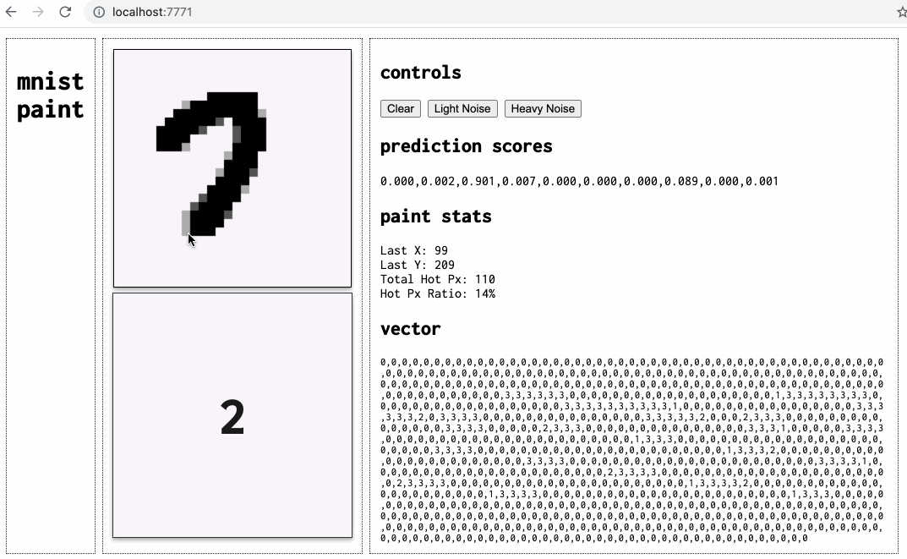

# mnist paint

Example handwritten digit OCR using tensorflow.js and canvas.

The example model is a basic CNN trained using Keras on the MNIST handwritten digits dataset - see notebook for details.

To run, start an HTTP server in the root of the directory, e.g.:

```bash
python3 -m http.server 7771
```


